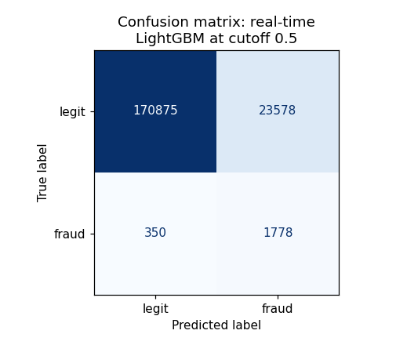
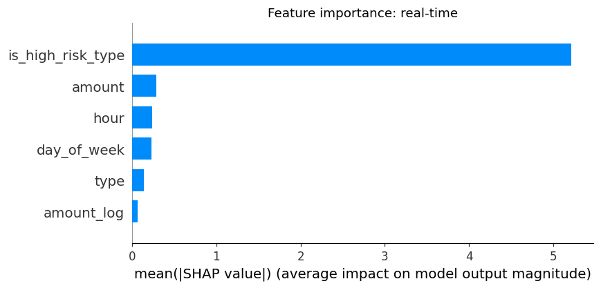
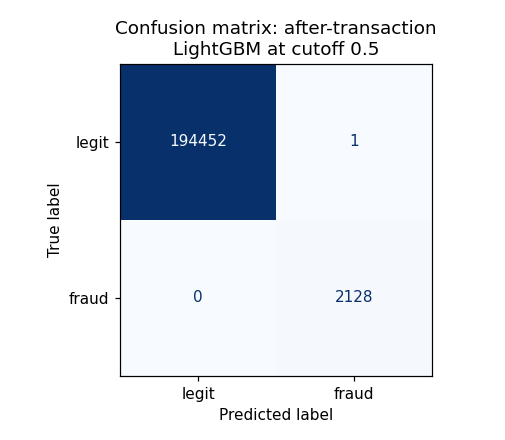
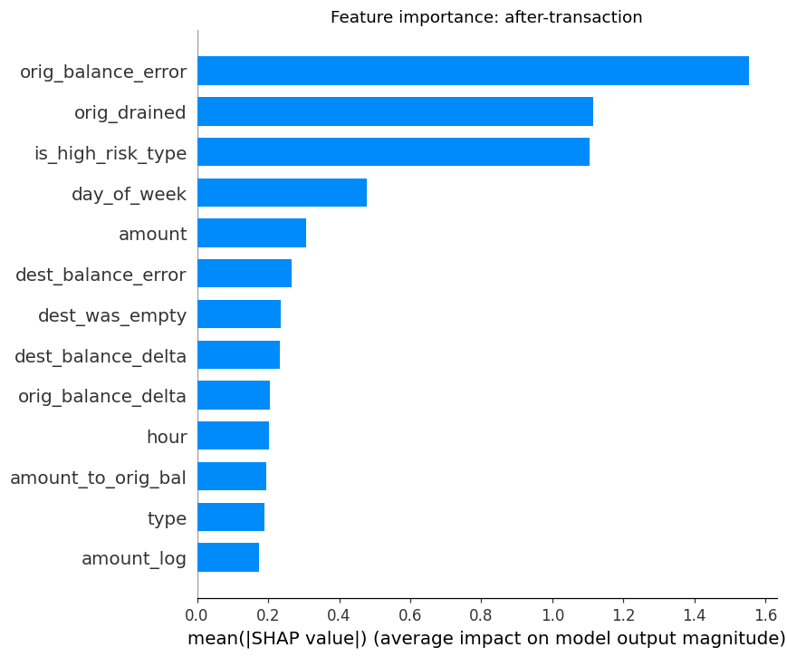

# PaySim: ETL, Reconciliation, and Fraud Detection

An end-to-end project on the [PaySim](https://www.kaggle.com/datasets/ealaxi/paysim1) mobile-money dataset. It cleans and loads the raw transactions, reconciles them against a simulated settlement file, then builds and evaluates fraud-detection models. Two notebooks, plain Python and SQLite. Dataset details are in [`DataDescription.MD`](DataDescription.MD).

## Stack

- **Data:** Python, pandas, NumPy, SQLite
- **Models:** scikit-learn, XGBoost, LightGBM
- **Explainability & plots:** SHAP, Matplotlib
- **Environment:** Jupyter notebooks

## What's inside

**[`01_etl_reconciliation.ipynb`](01_etl_reconciliation.ipynb) (ETL and reconciliation)**
- Loads the raw CSV, builds a stable `txn_id`, runs data-quality checks, and quarantines bad rows with a reason.
- Loads only the clean rows into a SQLite "system of record."
- Simulates a messy settlement file (edited amounts, missing rows, duplicates) and reconciles it: missing, phantom, duplicate, and amount-mismatch.
- Builds SQL views for daily volume, per-user spend, and balance anomalies.

**[`02_fraud_detection.ipynb`](02_fraud_detection.ipynb) (fraud detection)**
- EDA (class imbalance, amounts, balances, timing) and a baseline from the existing `isFlaggedFraud` rule.
- Two scenarios, split by when the model runs:
  - **Real-time** (before the payment settles): amount, type, time.
  - **After the transaction** (clawback): also uses balance changes.
- A time-based train/test split, and four models (Logistic Regression, Random Forest, XGBoost, LightGBM) compared on PR-AUC.
- Decision-threshold tuning, plus confusion matrices and SHAP for both scenarios.
- An appendix that measures how much of the after-the-transaction boost is a real signal vs a quirk of the synthetic data.

## Key results

**What PR-AUC means.** It scores how well the model ranks real fraud above legitimate transactions across every possible cutoff. 1.0 is perfect; random guessing scores about the fraud rate itself (here roughly 0.01, since only about 1% of the test transactions are fraud). So the real-time score of ~0.45 is far better than chance but far from perfect, which is about what amount, type, and time alone can do.

| Model / rule | Real-time PR-AUC | After-transaction PR-AUC |
|---|---|---|
| LightGBM (best) | ~0.45 | ~1.00 (*) |
| Existing rule `isFlaggedFraud` | F1 ~0.004 (catches 0.2% of fraud) | n/a |

(*) The near-perfect after-the-transaction score is not realistic. PaySim builds fraud by emptying the account, so the balance columns basically restate the label. The appendix shows `amount == oldbalanceOrg` holds for about 98% of fraud vs about 0% of legitimate transactions. A real system would do well here, but not perfectly.

## Example outputs

LightGBM at the 0.5 cutoff, real-time (Scenario A) vs after-transaction (Scenario B). The after-transaction model looks near-perfect only because the balance features restate the label (see the appendix).

| | Confusion matrix | Feature importance (SHAP) |
|---|---|---|
| **Real-time** |  |  |
| **After transaction** |  |  |

## Key decisions & approaches

- **Production-realistic labels:** `isFraud` is dropped before the database and rejoined later through `txn_id`, because in production you do not know the label at the moment a payment happens.
- **Clean system of record:** Only validated rows enter SQLite; bad rows are quarantined with a tagged reason instead of being silently dropped.
- **Reconciliation by counts:** Comparing per-`txn_id` counts catches double-settlements that a simple outer join would hide.
- **Two type of detection:** Real-time (before settlement) and after-the-transaction. The difference is which features to model on.
- **Time-based split:** Train on earlier steps, test on later ones, so the model is never tested on the past it trained on.
- **Class weighting, not SMOTE:** Weighting the rare class avoids inventing fake transactions and keeps the predicted probabilities meaningful.

## Layout

| Path | What |
|------|------|
| [`01_etl_reconciliation.ipynb`](01_etl_reconciliation.ipynb) | ETL, quarantine, reconciliation, SQL views |
| [`02_fraud_detection.ipynb`](02_fraud_detection.ipynb) | EDA, features, models, evaluation, appendix |
| [`DataDescription.MD`](DataDescription.MD) | Dataset and column reference |
| `data/raw/` | Put `paysim.csv` here (download from Kaggle) |
| `data/`, `db/` | Generated by notebook 01 (not tracked in git) |

## Setup and run

```bash
pip install -r requirements.txt
```

1. Download `paysim.csv` from [Kaggle](https://www.kaggle.com/datasets/ealaxi/paysim1) and put it in `data/raw/`.
2. Run [`01_etl_reconciliation.ipynb`](01_etl_reconciliation.ipynb) to build `db/transactions.db`.
3. Run [`02_fraud_detection.ipynb`](02_fraud_detection.ipynb) to train and evaluate the models.

Run the notebooks from the repo root, since the paths are relative.

## Notes

- **Data files are not in git.** They are large (about 1.7 GB total); download `paysim.csv` from Kaggle, and notebook 01 regenerates the rest.
- For the leakage details, see [`DataDescription.MD`](DataDescription.MD) and the appendix in [`02_fraud_detection.ipynb`](02_fraud_detection.ipynb).
